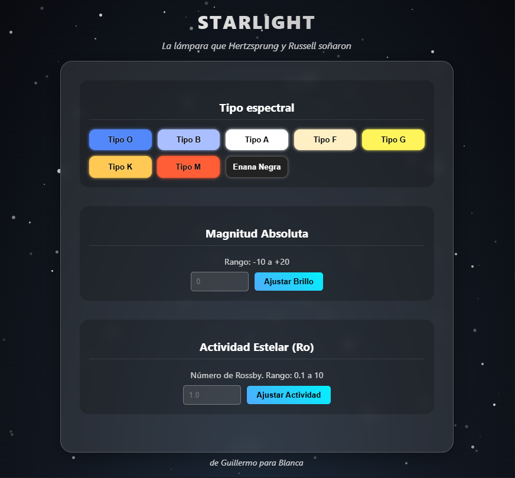
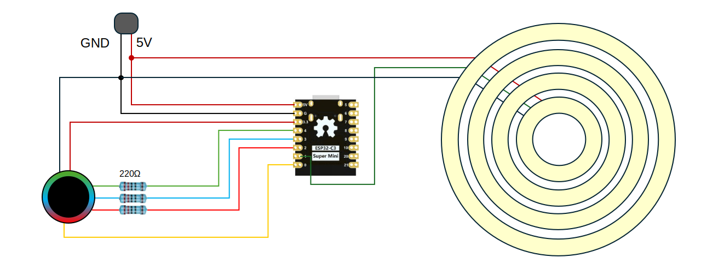

¿Alguna vez has querido experimentar una reacción de fusión en tu escritorio? ¿Vivir la secuencia principal con una simple pulsación? Esta es tu lámpara; la lámpara que Hertzsprung y Russel soñaron. Russell no el de la F1, sino el bueno de Henry Norris Russell. Insisto, no tiene absolutamente nada que ver con la F1.

- [Componentes de la lámpara](#componentes-de-la-lámpara)
- [Manual de uso](#manual-de-uso)
  - [Configuración remota](#configuración-remota)
  - [Configuración manual](#configuración-manual)
  - [Precauciones de seguridad](#precauciones-de-seguridad)
- [Open Access](#open-access)
  - [Código fuente](#código-fuente)
  - [Diagrama de cableado](#diagrama-de-cableado)

## Componentes de la lámpara

La siguiente figura muestra los componentes de la lámpara

1. Tulipa
2. Base
3. Led del botón
4. Botón
5. Puerto USB-c
6. Entrada de alimentación 5V

 

## Manual de uso

Para encender la lámpara, simplemente conéctala a la corriente mediante un adaptador DC de 5V (y preferentemente hasta 3A mínimo). La lámpara recuperará la última configuración y se encenderá en el modo por defecto.

En el modo por defecto el led del botón (3) se encuentra apagado en todo momento, y cada pulsación corta en el botón permite cambiar el tipo espectral de la estrella. Cuenta con los siguientes tipos espectrales según el *sistema Harvard*, de la astrónoma Annie Jump Cannon.

 

| Tipo espectral | Color |
| - | - |
| O | Azul |
| B | Blanco azulado |
| A | Blanco |
| F | Blanco amarillento |
| G | Amarillo |
| K | Naranja |
| M | Rojo |
| Enana negra | Apagado |

### Configuración remota

Nos encontramos ante la primera estrella con conectividad WiFi. Las poderosas ondas electromagnéticas procedentes del mismo núcleo generan una red WiFi llamada `Starlight-BMC` a la que puedes conectarte para controlar la lámpara desde la comodidad de tu dispositivo preferido: Móvil, ordenador, Nintendo DS o nevera inteligente.

Para mayor seguridad, la red se encuentra protegida mediante las siguientes credenciales. De esta manera el Mossad no puede conectarse desde el piso de abajo y causar una supernova.

**SSID:** `Starlight-BMC`   **Contraseña:** `lamparita.7`

Una vez conectada a la red de la lámpara, puedes acceder a la interfaz de control a través de la siguiente dirección web en cualquier navegador.

**Dirección web:** `192.168.7.7`

Ahí encontrarás esta interfaz.

Ahí podrás configurar todos los parámetros de la estrella. El **tipo espectral** permite ajustar el color de emisión estelar. La Enana Negra, a pesar de parecer un intento de inclusión de minorías, se trata del hipotético estado en el que una enana blanca se enfría por completo dejando de emitir. El universo no tiene la edad suficiente para que esto haya podido ocurrir aún, pero este pequeño reactor de fusión va adelantado a los tiempos.

La **magnitud absoluta** permite ajustar la iluminación de la estrella. El rango de valores posibles va desde +20 (las estrellas enanas más débiles) hasta -10 (las supergigantes más luminosas). Puesto que medir 10pc es complicado sin salir de Almería, la definición estricta de magnitud absoluta se ha reescalado de la siguiente manera:

*La magnitud absoluta (M) es la magnitud aparente, m, que tendría un objeto si estuviera a una distancia *~~de 10 pársecs~~* equivalente a la separación entre el escritorio y la cama.*

La **actividad estelar** permite ajustar la dinámica de emisión. Viene caracterizada por el número de Rossby (Ro), el ratio entre la fuerza de aceleración y la fuerza de Coriolis en un fluido. Este parámetro relaciona rotación con actividad magnética, con estrellas de bajo Ro siendo más activas (Corsaro et al. 2021 A&A, 652). El rango de Ro permitido va de 0.1 a 10.

 

### Configuración manual

Una pulsación corta en el botón en en el modo por defecto (led del botón apagado) permite alternar el tipo espectral de la estrella. Una pulsación larga en el botón permite entrar al **modo configuración**. El led del botón comenzará a parpadear.

El modo configuración permite alterar los 3 parámetros de control de la estrella, cada uno asociado con un color del botón. Una pulsación corta en este menú de configuración permite alternar el parámetro a configurar. Una vez seleccionado el parámetro a ajustar mediante el color correspondiente (ver siguiente tabla), una pulsación larga permite entrar en el ajuste del mismo. 

| Color del botón | Parámetro |
| - | - |
| Verde | Tipo espectral (por defecto) |
| Azul | Magnitud absoluta |
| Rojo | Actividad estelar |

En el modo **por defecto** se ajusta el **tipo espectral**, comentado anteriormente. En este modo, el led del botón se apagará para disfrutar sin cortapisas de la radiación estelar. Un toque corto al botón alterna el tipo espectral (color) de la estrella.

En el ajuste de **magnitud absoluta** (botón azul) puedes cambiar el brillo de la lámpara. Un toque corto al botón incrementará el brillo hasta alcanzar el máximo, volviendo posteriormente al valor más bajo. En configuración manual, la lámpara cuenta con 10 pasos de brillo.

En el ajuste de **actividad estelar** (botón rojo) puedes cambiar la dinámica de la estrella, simulando erupciones y dinámica atmosférica, añadiendo un ruido a la emisión. Un toque corto al botón incrementará la actividad estelar hasta alcanzar el máximo, volviendo posteriormente al valor más bajo. Existen 4 pasos de ruido.

**Nota del desarrollador.** Cuando se actualice por primera vez el estado de la lámpara, trascurrirán 10s hasta que se almacene en su memoria y poder recuperarlo al encender. Esto ocurre así para evitar el desgaste excesivo por escritura de la memoria permanente ante múltiples cambios consecutivos.

### Precauciones de seguridad

El puerto USB-c permite reprogramar la lámpara y modificar su código o sistema de archivos. No enchufes el USB-c a dispositivo (p.e., ordenador) mientras se encuentre conectado a la corriente. Esto podría causar daños en el controlador.

Luces blancas con mucha intensidad durante tiempos prolongados pueden generar un ligero calentamiento de los leds, que puede deteriorar el material de la tulipa (PLA) si se superan los 60 grados. Ante cualquier comportamiento inesperado, contactar con Guillermo.

##  Open Access

Este proyecto es completamente Open Access (GPL), con el código fuente y el diagrama de cableado disponibles públicamente.

### Código fuente

El código fuente del controlador se encuentra disponible en [github.com/guillezuhe/Starlight](https://github.com/guillezuhe/Starlight).

### Diagrama de cableado

